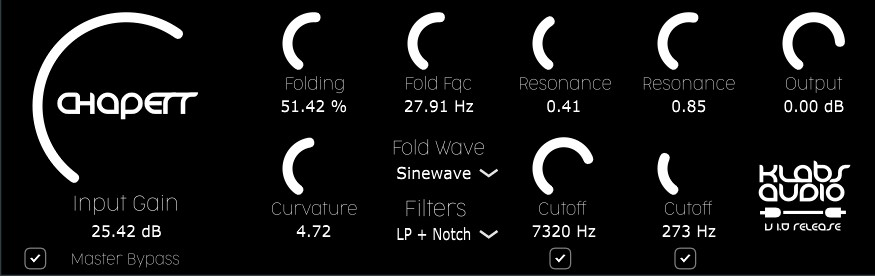

## Chaperr

A Waveshaper / Wavefolder plug-in.

### How to install it (on Windows)

1. Download the [zip file](https://github.com/klabsaudio/Chaperr/raw/master/Chaperr_Windows_x64.zip).
2. Unzip the files.
3. Move the .dll and the .vst3 to your plug-in folders. These can be :

C:\Program Files (x86)\VSTPlugIns  
C:\Program Files\VstPlugins  
C:\Program Files\Common Files\VST3  
C:\Program Files (x86)\Steinberg\VstPlugins  
C:\Program Files\Steinberg\VstPlugins  

4. Launch your favorite DAW.

### How to install it (on OSX)

WIP
